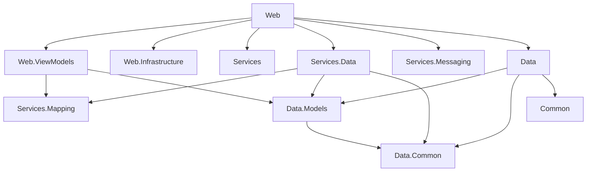

# ASP.NET Core Template

A ready-to-use, layered ASP.NET Core 10 MVC solution template with Identity, EF Core, the repository pattern, Mapster mappings, dependency injection, tests and StyleCop warnings fixed.

[](https://github.com/NikolayIT/ASP.NET-Core-Template/actions/workflows/build.yml)
[](https://www.nuget.org/packages/AspNetCoreTemplate)
[](https://www.nuget.org/packages/AspNetCoreTemplate)
[](https://github.com/NikolayIT/ASP.NET-Core-Template/blob/master/LICENSE)


## What's Included

- **.NET 10** solution in the new `.slnx` format, split into Common, Data, Services, Web and Tests layers
- **ASP.NET Core MVC** with an `Administration` area restricted to the `Administrator` role
- **ASP.NET Core Identity** (default UI) with custom `ApplicationUser` and `ApplicationRole`
- **Entity Framework Core** with SQL Server, migrations applied on startup and data seeding
- **Generic repositories** with audit info (`CreatedOn`, `ModifiedOn`) and soft delete (`IsDeleted`, `DeletedOn`) handled automatically
- **Mapster** mappings declared on the view models via `IMapFrom<T>`, `IMapTo<T>` and `IHaveCustomMappings`
- **SendGrid** e-mail sender (and a `NullMessageSender` for development)
- **Bootstrap 5.3**, **jQuery 4** and **jQuery Validation**, restored with [LibMan](https://learn.microsoft.com/aspnet/core/client-side/libman/) at build time and bundled/minified with [WebOptimizer](https://github.com/ligershark/WebOptimizer)
- **xUnit.net v3** unit tests (Moq and the EF Core in-memory provider) and integration tests with `WebApplicationFactory`, running on [Microsoft Testing Platform](https://learn.microsoft.com/dotnet/core/testing/microsoft-testing-platform-intro)
- **StyleCop analyzers** and selected .NET code analysis rules configured in `.globalconfig` and `stylecop.json`, and **central package management** (`Directory.Packages.props`)
- **GitHub Actions** workflow that builds the solution and runs the tests

## Screenshots

| Registration with client-side validation | Settings (entities mapped with Mapster) |
| --- | --- |
|  |  |
| **Account management (ASP.NET Core Identity)** | **Administration area** |
|  |  |

<p align="center">
  
</p>

## Getting Started

### Prerequisites

- [.NET 10 SDK](https://dotnet.microsoft.com/download/dotnet/10.0)
- SQL Server (LocalDB, Express, Developer or a Docker container)
- Visual Studio 2026, Visual Studio Code or JetBrains Rider (optional)

### Create a New Project

Install the template from [NuGet](https://www.nuget.org/packages/AspNetCoreTemplate):

```powershell
dotnet new install AspNetCoreTemplate
```

Create a project from it. Every `AspNetCoreTemplate` occurrence in file names, namespaces and the database name is replaced with your project name:

```powershell
dotnet new aspnet-core -n YourProjectName -o YourProjectName
```

After creating the files, `dotnet new` asks whether to run `dotnet format`, which re-sorts the `using` directives for your project name so the StyleCop analyzers report no warnings. Answer yes, or pass `--allow-scripts yes` to skip the question.

Alternatively, clone this repository and run the [TemplateRenamer](https://github.com/NikolayIT/ASP.NET-Core-Template/tree/master/tools/TemplateRenamer) tool from the `src` folder to rename the solution in place, then run `dotnet format --diagnostics SA1210 --severity warn` there.

### Run the Application

1. Set the `DefaultConnection` connection string in `Web/YourProjectName.Web/appsettings.json` (it defaults to `Server=.;Database=YourProjectName;Trusted_Connection=True;...`). For LocalDB use `Server=(localdb)\\mssqllocaldb`.
2. Run the web project from the solution folder:

   ```powershell
   cd YourProjectName
   dotnet run --project Web/YourProjectName.Web
   ```

   The database is created and migrated on startup and the seeders add the `Administrator` role and a sample setting.
3. Register a user and add it to the `Administrator` role to access the administration area, for example:

   ```sql
   INSERT INTO AspNetUserRoles (UserId, RoleId)
   SELECT u.Id, r.Id FROM AspNetUsers u, AspNetRoles r
   WHERE u.Email = 'you@example.com' AND r.Name = 'Administrator'
   ```

### Add a Migration

The `Data` project contains a design-time `DbContext` factory that reads its own `appsettings.json`, so migrations are created from that folder with the [EF Core tools](https://learn.microsoft.com/ef/core/cli/dotnet):

```powershell
cd Data/YourProjectName.Data
dotnet ef migrations add YourMigrationName
```

### Run the Tests

The test projects use xUnit.net v3 on Microsoft Testing Platform, which `global.json` turns on for `dotnet test`, so run it from the solution folder:

```powershell
dotnet test YourProjectName.slnx
```

Each test project is also a standalone executable, so `dotnet run --project Tests/YourProjectName.Services.Data.Tests` works as well.

The `Web.Tests` project starts the whole application with `WebApplicationFactory`, so it needs a reachable SQL Server. You can point it at a separate database with an environment variable:

```powershell
$env:ConnectionStrings__DefaultConnection = "Server=.;Database=YourProjectName_Tests;Trusted_Connection=True;TrustServerCertificate=True"
dotnet test YourProjectName.slnx
```

## Project Overview



### Common

**AspNetCoreTemplate.Common** contains things shared by the whole solution, for example [GlobalConstants.cs](https://github.com/NikolayIT/ASP.NET-Core-Template/blob/master/src/AspNetCoreTemplate.Common/GlobalConstants.cs) with the system name and the administrator role name.

### Data

- [**AspNetCoreTemplate.Data.Common**](https://github.com/NikolayIT/ASP.NET-Core-Template/tree/master/src/Data/AspNetCoreTemplate.Data.Common) contains the base entity classes (`BaseModel<TKey>`, `BaseDeletableModel<TKey>`), the `IAuditInfo` and `IDeletableEntity` interfaces and the `IRepository<T>` and `IDeletableEntityRepository<T>` abstractions of the **repository pattern**.
- [**AspNetCoreTemplate.Data.Models**](https://github.com/NikolayIT/ASP.NET-Core-Template/tree/master/src/Data/AspNetCoreTemplate.Data.Models) contains the entities, including `ApplicationUser` and `ApplicationRole`, which extend the Identity user and role.
- [**AspNetCoreTemplate.Data**](https://github.com/NikolayIT/ASP.NET-Core-Template/tree/master/src/Data/AspNetCoreTemplate.Data) contains the `ApplicationDbContext`, the entity configurations, the migrations, the seeders and the EF Core repository implementations. The `DbContext` fills in the audit info on save and applies a global query filter that hides soft-deleted entities, while `Delete` in the deletable entity repository only marks entities as deleted (`HardDelete` and `Undelete` are also available).

### Services

- [**AspNetCoreTemplate.Services.Data**](https://github.com/NikolayIT/ASP.NET-Core-Template/tree/master/src/Services/AspNetCoreTemplate.Services.Data) contains the business logic that works with the repositories.
- [**AspNetCoreTemplate.Services.Mapping**](https://github.com/NikolayIT/ASP.NET-Core-Template/tree/master/src/Services/AspNetCoreTemplate.Services.Mapping) registers the [Mapster](https://github.com/MapsterMapper/Mapster) mappings declared on your classes and provides the `To<T>()` projection for `IQueryable`.
- [**AspNetCoreTemplate.Services.Messaging**](https://github.com/NikolayIT/ASP.NET-Core-Template/tree/master/src/Services/AspNetCoreTemplate.Services.Messaging) contains the `IEmailSender` abstraction with a ready-to-use [SendGrid](https://sendgrid.com/) implementation.
- [**AspNetCoreTemplate.Services**](https://github.com/NikolayIT/ASP.NET-Core-Template/tree/master/src/Services/AspNetCoreTemplate.Services) is the place for services that do not depend on the database.

#### Mappings

Implement `IMapFrom<TSource>` (or `IMapTo<TDestination>`) and the mapping is registered on startup:

```csharp
using AspNetCoreTemplate.Data.Models;
using AspNetCoreTemplate.Services.Mapping;

public class TagViewModel : IMapFrom<Tag>
{
    public int Id { get; set; }

    public string Name { get; set; }
}
```

Implement `IHaveCustomMappings` when some members need custom configuration:

```csharp
using AspNetCoreTemplate.Data.Models;
using AspNetCoreTemplate.Services.Mapping;

public class PostViewModel : IMapFrom<Post>, IHaveCustomMappings
{
    public int Id { get; set; }

    public string Title { get; set; }

    public string AuthorName { get; set; }

    public void CreateMappings(Mapster.TypeAdapterConfig configuration)
    {
        configuration.NewConfig<Post, PostViewModel>()
            .Map(destination => destination.AuthorName, source => source.Author.UserName);
    }
}
```

Then project queries straight to view models, so only the needed columns are selected:

```csharp
var posts = this.postsRepository.AllAsNoTracking().To<PostViewModel>().ToList();
```

> [!NOTE]
> Mapster has its own `Mapster.IMapFrom<T>` interface, so avoid `using Mapster;` next to `using AspNetCoreTemplate.Services.Mapping;` and write `Mapster.TypeAdapterConfig` instead.

### Web

- [**AspNetCoreTemplate.Web**](https://github.com/NikolayIT/ASP.NET-Core-Template/tree/master/src/Web/AspNetCoreTemplate.Web) is the ASP.NET Core MVC application (controllers, views, the `Administration` area, Identity and static files).
- [**AspNetCoreTemplate.Web.ViewModels**](https://github.com/NikolayIT/ASP.NET-Core-Template/tree/master/src/Web/AspNetCoreTemplate.Web.ViewModels) contains the view and input models, mapped from and to the entities.
- [**AspNetCoreTemplate.Web.Infrastructure**](https://github.com/NikolayIT/ASP.NET-Core-Template/tree/master/src/Web/AspNetCoreTemplate.Web.Infrastructure) is the place for middlewares, filters, tag helpers and other web infrastructure.

### Tests

- [**AspNetCoreTemplate.Services.Data.Tests**](https://github.com/NikolayIT/ASP.NET-Core-Template/tree/master/src/Tests/AspNetCoreTemplate.Services.Data.Tests) contains xUnit.net v3 unit tests for the service layer and the mappings, using Moq and the EF Core in-memory provider.
- [**AspNetCoreTemplate.Web.Tests**](https://github.com/NikolayIT/ASP.NET-Core-Template/tree/master/src/Tests/AspNetCoreTemplate.Web.Tests) contains integration tests that host the application with `WebApplicationFactory`.
- [**Sandbox**](https://github.com/NikolayIT/ASP.NET-Core-Template/tree/master/src/Tests/Sandbox) is a console application with the full dependency injection setup, handy for trying out services and running one-off tasks.

## Pack the Template

```powershell
dotnet pack .\nuget.csproj
```

Publishing a GitHub release whose tag matches the `Version` in `nuget.csproj` packs the template and publishes it to NuGet automatically ([publish.yml](https://github.com/NikolayIT/ASP.NET-Core-Template/blob/master/.github/workflows/publish.yml), using nuget.org Trusted Publishing).

## Authors

- [Nikolay Kostov](https://github.com/NikolayIT)
- [Vladislav Karamfilov](https://github.com/vladislav-karamfilov)
- [Stoyan Shopov](https://github.com/StoyanShopov)

## Example Projects

- <https://github.com/NikolayIT/PressCenters.com>
- <https://github.com/NikolayIT/nikolay.it>

## Support

If you are having problems, please let us know by [raising a new issue](https://github.com/NikolayIT/ASP.NET-Core-Template/issues).

## License

This project is licensed under the [MIT license](https://github.com/NikolayIT/ASP.NET-Core-Template/blob/master/LICENSE).
